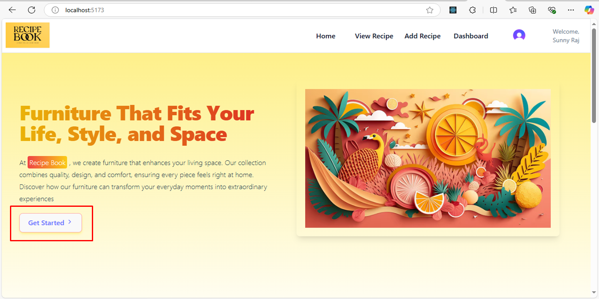
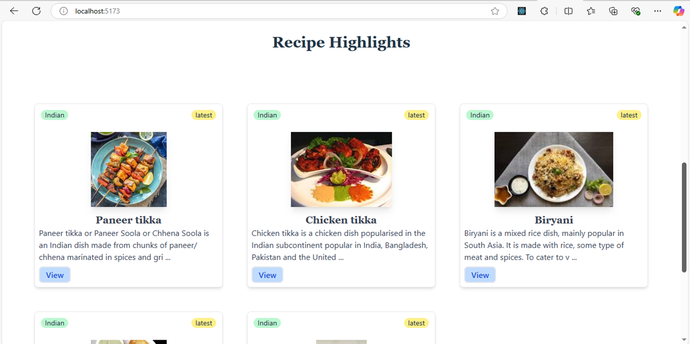
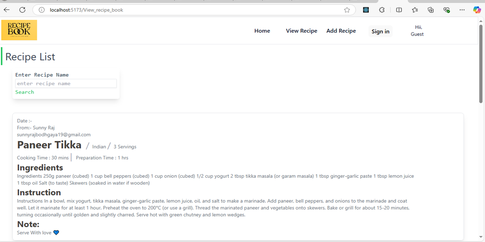
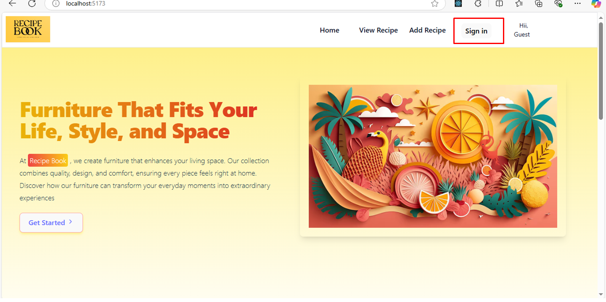
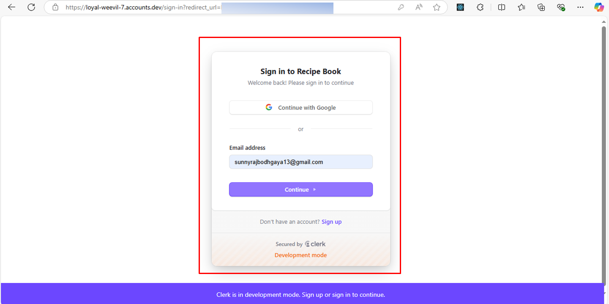
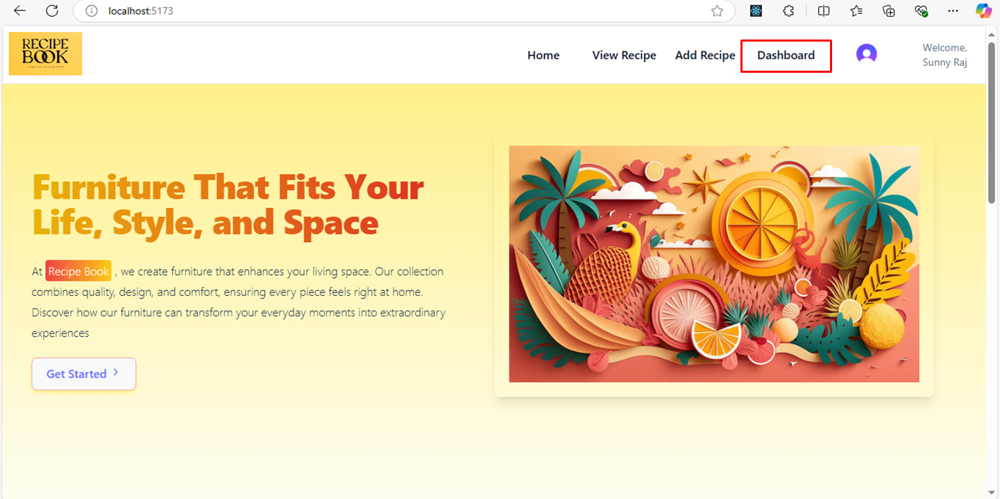
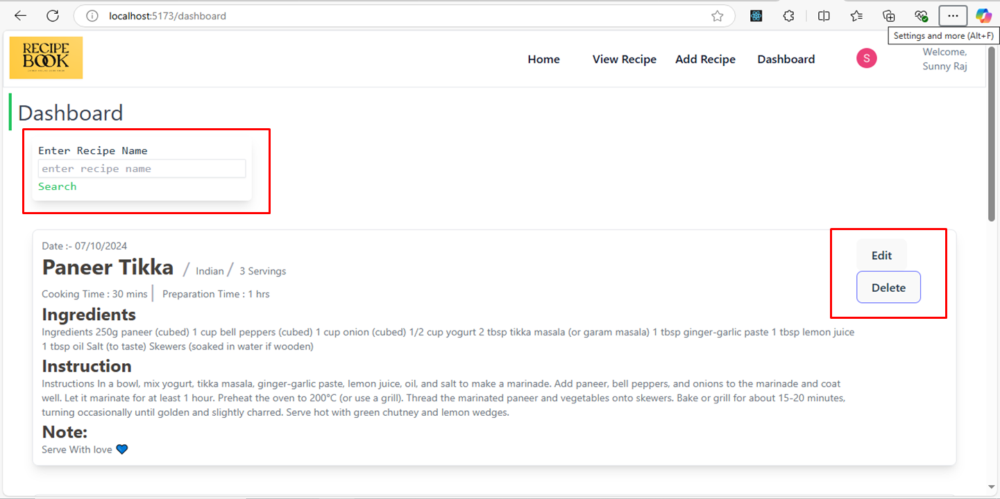
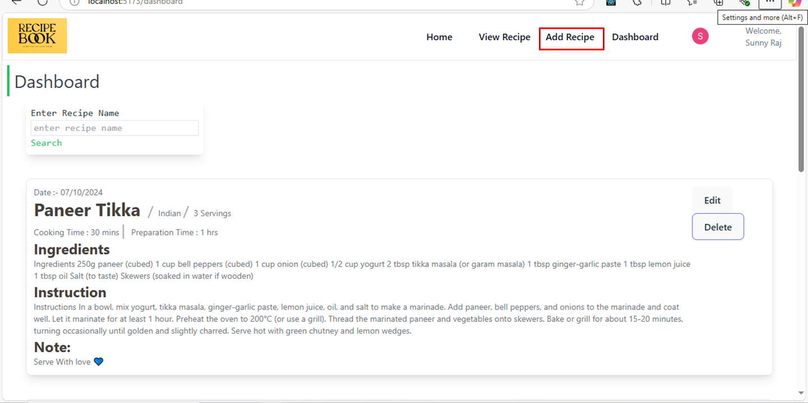

# ✨ Recipe Book Web Application

This fully responsive Recipe Book web application was developed as part of an internship project provided by Unified Mentor Pvt Ltd, where I learned a great deal about building robust and user-centric web applications. The project focuses on providing an intuitive and seamless experience for users who wish to explore, manage, and share recipes.

 

# Technologies Used 👩🏻‍💻:

- **Frontend:** The application was built using React.js, taking advantage of its component-based architecture for dynamic UI updates and efficient state management.

- **Backend & Database:** **Firebase** was used as both the backend and database service. Firebase provides real-time database capabilities, user authentication, and secure data storage for managing user-specific recipe data.

- **Logo:** The logo of the application was designed using Loger, a simple tool for creating visually appealing logos that complement the app's branding.

# Key Functionalities 🔑:

- Recipe Search:
  Both logged-in and non-logged-in users can search for and browse recipes. This feature ensures that all users, regardless of their login status, can explore the rich database of recipes available in the app.

- Protected Add/Edit Functionality:
  Only logged-in users have access to the Add Recipe section, ensuring that recipe submissions and edits are restricted to authenticated users. Non-logged-in users are unable to access this part of the application, creating a secure and personalized user experience.

- Personal Recipe Management:
  Logged-in users can add, edit, and delete their own recipes. Each user has their own separate recipe database, ensuring that they can manage their collection independently.

# Challenges Faced During Development and Solutions ✨:

One of the primary challenges I encountered during the development of this recipe book web application was related to routing and **user-specific data management**.

- Routing Challenges:
  Initially, I struggled with implementing protected routes to ensure that only authenticated users could access specific sections like the "Add Recipe" page. I had to dive deep into React Router and Firebase authentication to manage these routes securely.
  I learned how to properly set up protected routes by checking the user's authentication status before rendering certain components. This made sure that users who were not logged in couldn't access the recipe management features, while logged-in users had full access to their recipe database.
- User-Specific Database:
  Another challenge was configuring the Firebase database to store each user's recipes in a way that ensured separation between different users' data. This required a thorough understanding of Firebase's real-time database structure and how to create unique records for each authenticated user.
- I resolved this by using Firebase's authentication ID to create a separate node in the database for each user. This way, every logged-in user could manage their own recipes without affecting others' data. This approach also made retrieving and displaying user-specific data more efficient.

# New Skills Learned👨🏻‍🎓:

During the development of this recipe book web application, I gained valuable experience with several tools and technologies:

- **Firebase for Real-Time Database:**
  I learned how to leverage Firebase to manage real-time data, ensuring that any changes made by the user were instantly reflected in the app. This was particularly useful for handling user-specific recipes and enabling seamless data synchronization across devices.
- Firebase Authentication:
  Implementing user authentication was another key learning. I used Firebase’s authentication service to manage user sign-ins and sign-outs, ensuring secure access to the app's features. This experience enhanced my understanding of user authentication flows and how to integrate them within a React app.
- Clerk for Authentication:
  In addition to Firebase, I also explored Clerk, which helped me understand alternative authentication services and how to implement them for user management. Clerk offered a simple yet powerful way to manage user authentication and profiles.

(Through this project, I expanded my skillset in database management, real-time data synchronization, and authentication, making me more adept at creating secure, scalable, and user-friendly web applications.)

## WebApp Overview 🧡

